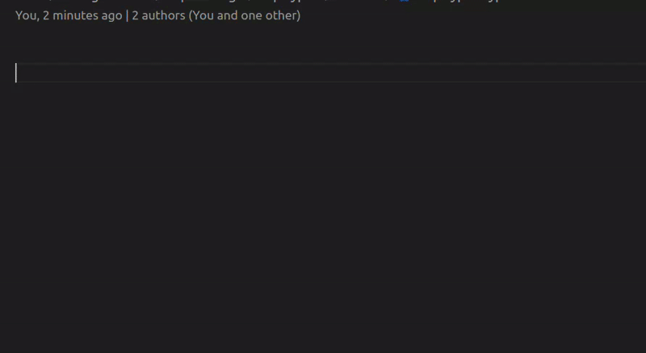

# ⚡ Advanced React Snippets 2025

🎯 *Tired of typing the same React boilerplate over and over again?*  
✨ **Advanced React Snippets** is here to cast a magical spell on your productivity!

---

## 📸 Demo



---

## 🚀 Why React Snippets?

Save keystrokes. Save time. Save your sanity.  
Whether you're building components, working with hooks, or setting up context — **Advanced React Snippets** has your back (and your code).

> 🪄 *"Turn repetitive typing into single-word magic!"*

---

## 💡 Usage

Start typing one of the prefixes, and IntelliSense will do the rest.  
Here's a taste of what you get:

---

## 💡 Snippet List

### 📦 Component Snippets

| Prefix  | Description                                      |
|---------|--------------------------------------------------|
| `fc`    | Function Component                               |
| `ffc`   | Function Syntax Component (Arrow Function)       |
| `sfc`   | Stateless Function Component                     |
| `sfnc`  | Stateless Function Named Component               |
| `cc`    | Class Component                                  |
| `ccc`   | Class Component with Constructor                 |
| `cpf`   | Class Property Function                          |
| `hoc`   | Higher Order Component                           |
| `ren`   | `render()` method                                |
| `rprop` | Render Prop pattern                              |

---

### 🧠 React Hooks

| Prefix  | Description                                      |
|---------|--------------------------------------------------|
| `usf`   | Declare `useState()` Hook                        |
| `uef`   | `useEffect()` Hook                               |
| `ucb`   | `useCallback()` Hook                             |
| `usr`   | Declare `useRef()` Hook                          |

---

### 🌐 Imports

| Prefix  | Description                                      |
|---------|--------------------------------------------------|
| `imr`   | Import React                                      |
| `imrc`  | Import React and `Component`                      |
| `impc`  | Import React and `PureComponent`                 |
| `imrd`  | Import `react-dom`                               |
| `imrs`  | Import React and `useState`                      |
| `imrse` | Import React, `useState`, and `useEffect`        |
| `impt`  | Import PropTypes                                 |

---

### 🏛️ Class Component Lifecycle

| Prefix  | Description                                      |
|---------|--------------------------------------------------|
| `cdm`   | `componentDidMount()`                            |
| `cdu`   | `componentDidUpdate()`                           |
| `cwun`  | `componentWillUnmount()`                         |
| `cdc`   | `componentDidCatch()`                            |
| `cwm`   | `componentWillMount()` *(legacy)*                |
| `cwrp`  | `componentWillReceiveProps()` *(legacy)*         |
| `cwu`   | `componentWillUpdate()` *(legacy)*               |
| `gds`   | `getDerivedStateFromProps()`                     |
| `gsbu`  | `getSnapshotBeforeUpdate()`                      |
| `scu`   | `shouldComponentUpdate()`                        |

---

### 📚 State Management

| Prefix  | Description                                      |
|---------|--------------------------------------------------|
| `ss`    | `this.setState()`                                |
| `ssf`   | Functional `setState()`                          |

---

### 🌳 Context API

| Prefix  | Description                                      |
|---------|--------------------------------------------------|
| `cp`    | Context Provider                                 |

---

💡 Use the prefix (e.g., `ffc`) in a React `.jsx` or `.tsx` file, press `Tab`, and the boilerplate code will appear like ✨ magic!

> ⌨️ Just type the prefix, hit `Tab`, and boom — the code appears!

---

## ✨ Features

✅ **Functional Components** (arrow + named)  
✅ **React Hooks**: `useState`, `useEffect`, `useCallback`, `useRef`, and more  
✅ **Class Components**: Legacy support for the nostalgia lovers  
✅ **Context API Boilerplates**  
✅ **Error Boundaries & Lifecycle Methods**  
✅ **ReactDOM, PropTypes Imports**  
✅ **TypeScript + JavaScript support**  
✅ **Naming conventions auto-filled** (with VS Code tabstop magic ✨)

---

## 🔧 Supported Languages

- 🟦 **JavaScript React** (`.jsx`)
- 🟨 **TypeScript React** (`.tsx`)

---

## 📦 Installation

Search for **`Advanced React Snippets`** in the VS Code Marketplace, or install via CLI:

```bash
code --install-extension HareeshBhittam.reactcraft-snippets
```

## 📜 License

MIT License

---

## ⭐ Support & Contribute

If you like this extension, **give it a star ⭐** and share it with other React devs!

Got ideas or feedback? Open an [issue](https://github.com/Hareesh108/reactcraft-snippets/issues) or create a pull request.  
Let’s build this together! 💪

## 🔮 About the Creator

Made with ❤️ by [Hareesh Bhittam](https://github.com/Hareesh108)  
Follow for more dev wizardry 🧙‍♂️✨
